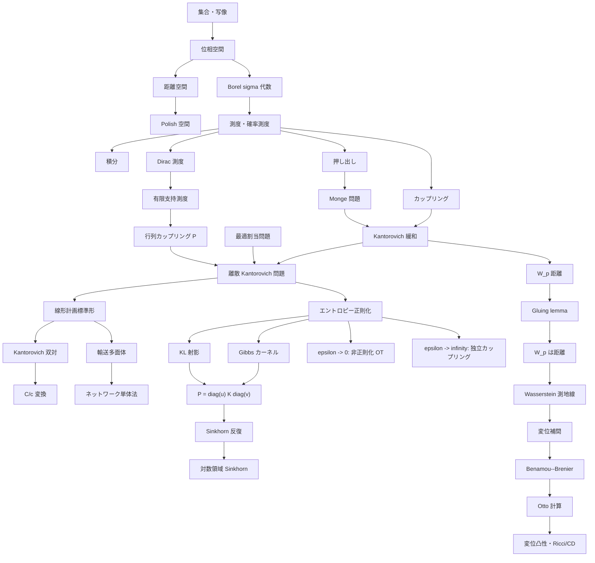

# セミナー全体地図

このファイルは `seminar/main.tex` とは独立した概念地図である。
有限次元の行列問題と無限次元の測度論的問題を区別し、それらの同一視・近似・極限の関係を明示する。

## 有限と無限の対応

| 対象 | 有限次元での形 | 無限次元での形 | 関係 |
| --- | --- | --- | --- |
| 確率測度 | `a in R_+^n`, `sum_i a_i = 1` | `alpha in M_+^1(X)` | 有限支持測度 `alpha = sum_i a_i delta_{x_i}` として厳密に埋め込める。 |
| カップリング | `P in R_+^{n x m}` with row/column sums | `pi in Pi(alpha,beta)` | 有限支持なら `pi = sum_{i,j} P_{ij} delta_{(x_i,y_j)}` で同一視できる。 |
| コスト | `C_{ij}` | `c(x,y)` | 有限支持では `C_{ij}=c(x_i,y_j)`。 |
| Kantorovich 問題 | `min_P <C,P>` | `inf_pi int c d pi` | 有限支持の場合、無限次元問題は有限次元 LP に一致する。 |
| 双対 | `max_{f_i+g_j <= C_{ij}} a^T f + b^T g` | `sup_{phi+psi <= c} int phi d alpha + int psi d beta` | 離散双対は有限次元 LP 双対、連続双対は測度論的線形計画の双対。 |
| `C/c` 変換 | `g_j = min_i(C_{ij}-f_i)` | `phi^c(y)=inf_x(c(x,y)-phi(x))` | 双対制約を等号で飽和させる操作。 |
| エントロピー正則化 | `min_P <C,P> - epsilon H(P)` | `inf_pi int c d pi + epsilon KL(pi | alpha tensor beta)` | Cuturi 型の計算論は主に有限・離散版で展開される。 |

## 近似の区別

| 名称 | 内容 | 注意点 |
| --- | --- | --- |
| 有限支持としての同一視 | `alpha=sum_i a_i delta_{x_i}`, `beta=sum_j b_j delta_{y_j}` を最初から扱う。 | 有限次元 LP は元の問題そのもの。 |
| 離散化 | 連続測度をサンプルや格子で有限測度に置き換える。 | 元の連続問題への収束は別途示す必要がある。 |
| 経験測度 | サンプル `x_1,...,x_n` から `hat alpha_n = n^{-1} sum_i delta_{x_i}` を作る。 | 統計誤差と計算誤差が分かれる。 |
| 半離散 OT | 一方が連続、他方が有限支持。 | Laguerre 分割や凸最適化と結びつく。 |
| 正則化極限 | `epsilon -> 0` で非正則化 OT に戻る。 | 有限次元ではコンパクト性とエントロピーの有界性で扱える。 |

## Cuturi/Peyre との対応

| セミナーの部分 | 主な内容 | Cuturi/Peyre との関係 |
| --- | --- | --- |
| 1. 準備 | 位相、測度、押し出し、凸性 | OT の測度論的定式化に必要な基礎を明示的に補う部分。 |
| 2. Monge/Kantorovich | Monge 問題、Kantorovich 緩和、双対、`c` 変換 | 最適輸送の標準的基礎理論。Cuturi/Peyre の理論章と同じ主軸。 |
| 3. 離散化と LP | 有限支持測度、輸送多面体、ネットワーク単体法 | 離散 OT と計算アルゴリズムへの移行。Cuturi/Peyre の計算論に対応。 |
| 4. エントロピー正則化 | KL 射影、Gibbs カーネル、Sinkhorn | Cuturi の主要な貢献と Peyre/Cuturi の中心的流れに対応。 |
| 5. 正則化の正当性 | 一意性、計算可能性、`epsilon -> 0` 極限 | Cuturi 型アルゴリズムを OT の近似として使う根拠。 |
| Wasserstein 幾何 | `W_p` 距離、測地線、変位補間、曲率 | Cuturi よりも Villani、Ambrosio--Gigli--Savare、Otto 計算に近い。 |
