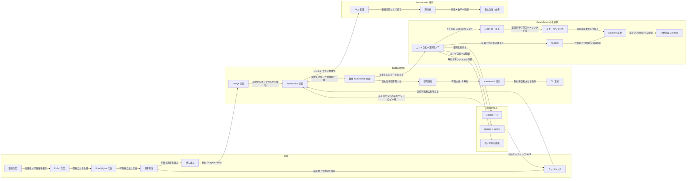
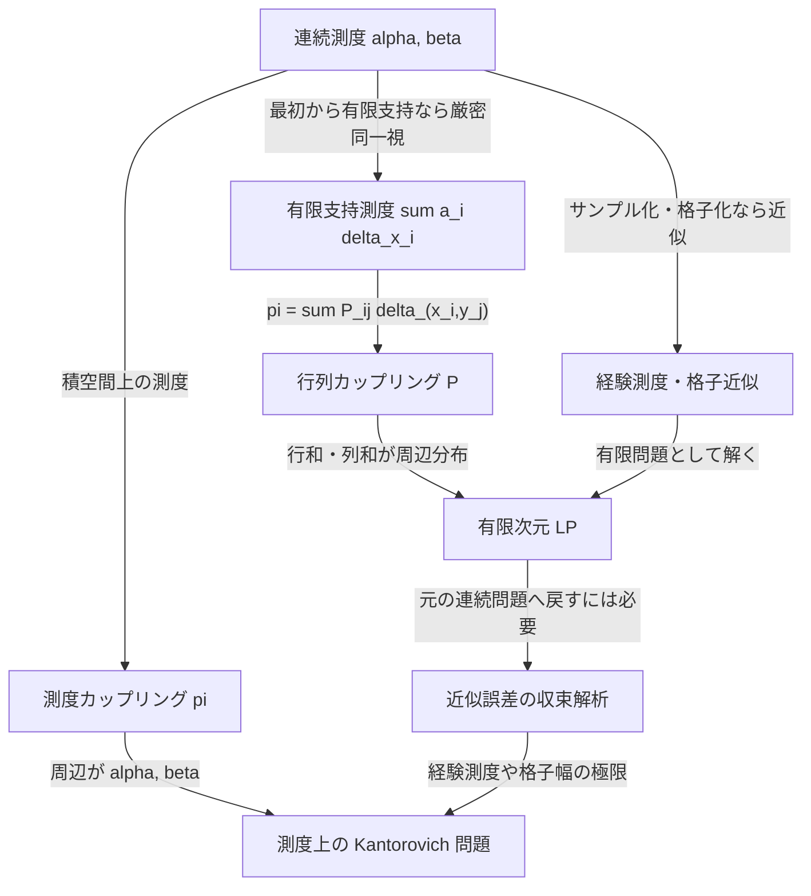

矢印ラベルは概念間の関係を表す。中央の「Cuturi/Peyre の主経路」は計算最適輸送の流れであり、Wasserstein 幾何はその後に接続される別系統の理論である。

有限と無限の行き来は、厳密な同一視と近似を分ける。

:::grid two
:::fact
## Cuturi/Peyre と同じ主軸

Monge/Kantorovich、離散 OT、LP、双対、エントロピー正則化、Gibbs カーネル、KL 射影、Sinkhorn という流れは Computational Optimal Transport の標準的な構成である。
:::

:::fact accent
## 幾何は別の主文脈

測地線、変位補間、曲率、勾配流は Villani、Ambrosio-Gigli-Savare、Otto 計算の文脈が強い。
:::
:::
