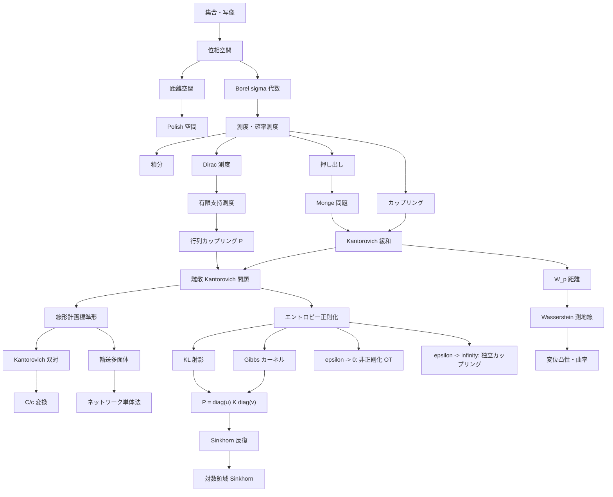

:::grid two
:::fact
## Cuturi/Peyre と同じ主軸

Monge/Kantorovich、離散 OT、LP、双対、エントロピー正則化、Sinkhorn という流れは Computational Optimal Transport の標準的な構成である。
:::

:::fact accent
## 幾何は別の主文脈

測地線、変位補間、曲率、勾配流は Villani、Ambrosio-Gigli-Savare、Otto 計算の文脈が強い。
:::
:::
